<h1 align="center">
  
</h1>

<h3 align="center"> Software Engineering student @ 42 Paris 🇫🇷 (AI Specialization)</h3>

  
  
  

  🟢 <b>Currently looking for a 6-month AI-related Software Engineer internship in Paris</b> — feel free to reach out at <a href="mailto:k.watanabeft@gmail.com">k.watanabeft@gmail.com</a>

- 🌱 Learning to build RAG and agentic LLM systems — moving from computer vision/classical ML into AI Engineer / product-integration work
- 🌏 Trained at 42 Tokyo, now at 42 Paris — chasing a global, not just domestic, view of how software companies run

## 🚀 Featured Projects

  <table>
    <tr>
      <td width="50%">
        <b>🏀 NBA Live Agent</b> — Live In-Game Reasoning Web App 
        Full-stack web app (FastAPI + Streamlit) powered by a hand-built LangGraph ReAct loop (Gemini + tool calling) over live <code>nba_api</code> feeds — ask "why isn't LeBron scoring this quarter?" and get a causal answer from play-by-play. 
              
        <a href="https://github.com/kojilbj/nba-live-agent">Repo →</a>
      </td>
      <td width="50%">
        <b>🍃 Leaffliction</b> — Plant Disease Diagnosis AI 
        Custom VGG-style CNN trained from scratch, with a custom data augmentation pipeline to fix class imbalance. 
        <b>97%+ validation accuracy</b> across all leaf pathology classes. 
           
        <a href="https://github.com/jaytakahashii/42_Leaffliction">Repo →</a>
      </td>
    </tr>
    <tr>
      <td width="50%">
        <b>🎩 DSLR</b> — Hogwarts Sorting Hat (Logistic Regression, From Scratch) 
        Multi-class logistic regression built from scratch — sigmoid, log-loss, batch gradient descent, One-vs-All — no scikit-learn. 
            
        <a href="https://github.com/kojilbj/dslr">Repo →</a>
      </td>
      <td width="50%">
        <b>🧠 Total Perspective Vortex</b> — EEG Brain-Computer Interface 
        Motor imagery classification (real vs. imagined movement) on 109-subject EEG data, with CSP implemented from scratch and a real-time streaming inference simulator. 
            
        <a href="https://github.com/kojilbj/total-perspective-vortex">Repo →</a>
      </td>
    </tr>
    <tr>
      <td width="50%">
        <b>⚫ Gomoku</b> — Game Engine & AI 
        High-performance game engine with an SFML GUI and a Minimax + Alpha-Beta pruning AI opponent, using heuristic evaluation to detect threats and winning patterns. 
          
        <a href="https://github.com/jaytakahashii/42_Gomoku">Repo →</a>
      </td>
      <td width="50%">
        <b>☸️ Inception-of-Things</b> — K3s Cluster & GitOps 
        Building K3s/K3d Kubernetes clusters from scratch with Vagrant, ingress routing, and automated GitOps continuous deployment with Argo CD. 
             
        <a href="https://github.com/Ceidoux/Inception-of-Things">Repo →</a>
      </td>
    </tr>
  </table>

## 🛠️ Languages And Tools

 

  <table>
    <tr>
      <td align="center" width="50%">
        <b>💻 Languages</b>  
        
      </td>
      <td align="center" width="50%">
        <b>🌐 Frontend & UI</b>  
        
      </td>
    </tr>
    <tr>
      <td align="center" width="50%">
        <b>⚙️ Backend & Architecture</b>  
        
      </td>
      <td align="center" width="50%">
        <b>🐳 DevOps & Tools</b>  
        
      </td>
    </tr>
  </table>

## 🧑🏻‍💻 Github Activity

